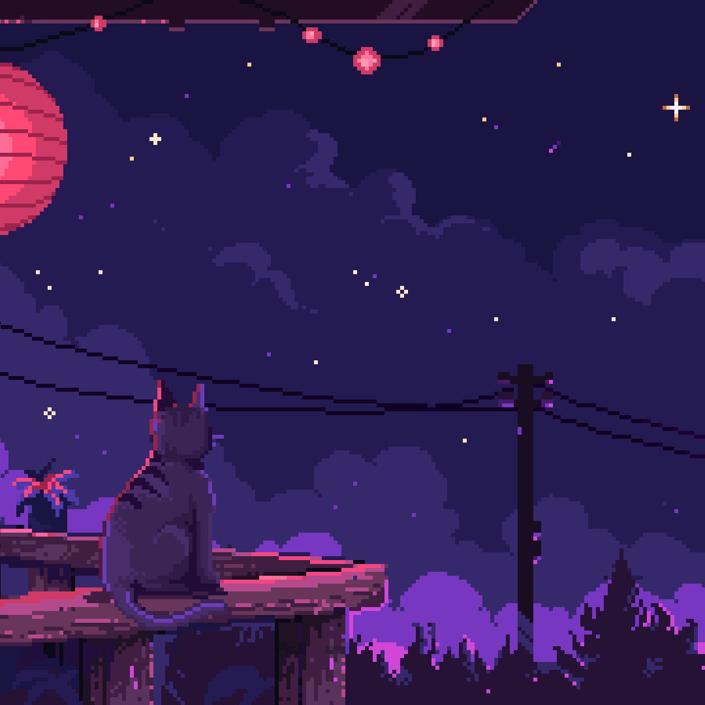

 

  

###

  

###

  

###

<h1 align="center">Hi, I'm Thiago 👋</h1>

###

<h2 align="left">👩‍💻  About Me</h2>

###

    

        I'm ... from Brazil... 
        São Paulo, SP  
        - 📚 I am currently studying Systems Development at Senai Suiço-Brasileira. 
        - ⚡ This semester, I am focusing more on back-end, front-end, and databases. 
        - 😍 I enjoy playing games, watching movies and series/anime, sports, motorsports (especially F1), drawing, reading, and studying.
    

    

        
    

###

<h3 align="center">I've recently entered this field, and I'm working hard to adapt.</h3>

###

<h2 align="center">✨ Tools✨</h2>

###

  
  
  
  
  
  
  
  
  
  
  
  
  

###

<h2 align="center">🎈Languages I use:</h2>

###

###

  
  
  
  
  
  
  
  
  

###

###
<h2 align="center">🔥   My Stats :</h2>
 

  

###

  

###

  
  

###

###

